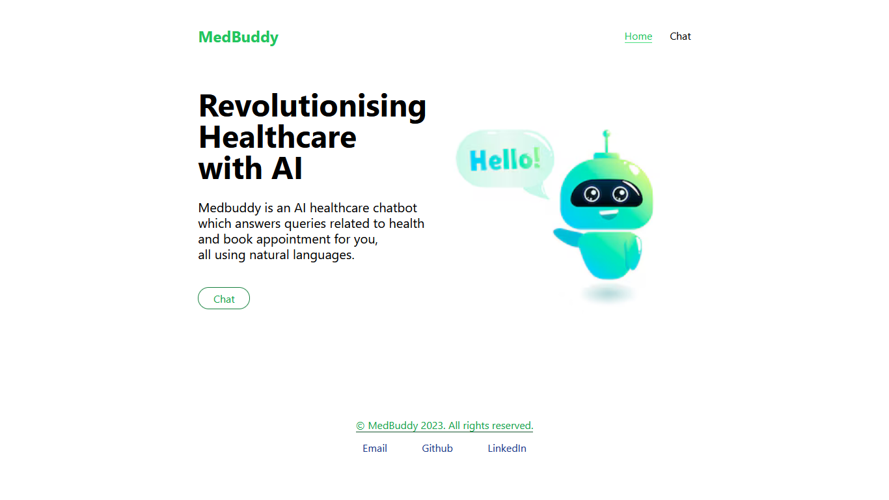

---

# MedBuddy MyCut

**MedBuddy MyCut** is a cutting-edge healthcare assistant application powered by generative AI. This project integrates advanced AI capabilities to enhance the process of connecting patients with healthcare professionals, making it easier to find doctors, schedule appointments, and manage healthcare-related queries efficiently.

## Project Overview

MedBuddy MyCut leverages the Gemini AI model to offer a comprehensive solution for healthcare management. Key features include:

- **Intelligent Doctor Matching**: Find doctors based on location and specialization with AI-driven search capabilities.
- **Appointment Booking**: Seamlessly book appointments with doctors through an interactive chatbot interface.
- **Real-Time Communication**: Receive automated email confirmations and reminders for both patients and doctors.
- **User-Friendly Interface**: A modern frontend built with React and Vite provides a smooth user experience.
- **Reliable Backend**: FastAPI-based backend ensures efficient data handling and integration with a MongoDB database.

## Features

- **AI-Powered Doctor Discovery**: Search for doctors by location and specialization, with detailed profiles including ratings, experience, and fees.
- **Appointment Management**: Book, reschedule, or cancel appointments with ease.
- **Email Notifications**: Automated confirmation and reminder emails for appointment scheduling.
- **Interactive Chatbot**: Engaging chatbot interface for natural interaction and query resolution.

## Technology Stack

- **Frontend**: React, Vite
- **Backend**: FastAPI, Python
- **AI Integration**: Gemini AI Model
- **Database**: MongoDB
- **Email Service**: Brevo (formerly Sendinblue)
- **Environment Management**: Virtualenv

## Project Structure

```
MedBuddy_mycut/
├── backend/
│   ├── api/
│   │   └── gemini_data.py
│   ├── database/
│   │   └── connect.py
│   ├── Routes/
│   │   └── doctor.py
│   └── Schema/
│       └── schema.py
├── frontend/
│   ├── node_modules/
│   ├── public/
│   │   └── vite.svg
│   ├── src/
│   │   ├── assets/
│   │   │   ├── chatbot.avif
│   │   │   └── react.svg
│   │   ├── components/
│   │   │   ├── Chat.jsx
│   │   │   ├── Footer.jsx
│   │   │   ├── Homepage.jsx
│   │   │   └── Navbar.jsx
│   │   ├── App.css
│   │   ├── App.jsx
│   │   ├── index.css
│   │   ├── main.jsx
│   │   └── output.css
│   ├── .gitignore
│   ├── eslint.config.js
│   ├── index.html
│   ├── package-lock.json
│   ├── package.json
│   ├── postcss.config.js
│   ├── README.md
│   ├── tailwind.config.js
│   └── vite.config.js
├── venv/
├── .env
├── .gitignore
├── main.py
├── medbuddy.iml
├── requirements.txt
└── test_main.http
```

## Setup and Installation

### Frontend

1. Navigate to the `frontend` directory:
    ```bash
    cd frontend
    ```

2. Install dependencies:
    ```bash
    npm install
    ```

3. Start the development server:
    ```bash
    npm run dev
    ```

### Backend

1. Create and activate a virtual environment:
    ```bash
    python -m venv venv
    source venv/bin/activate  # On Windows use `venv\Scripts\activate`
    ```

2. Install dependencies:
    ```bash
    pip install -r requirements.txt
    ```

3. Run the FastAPI server:
    ```bash
    uvicorn main:app --reload
    ```

## Environment Variables

Create a `.env` file in the root directory and add the following variables:

```
GOOGLE_API_KEY=<Your Google API Key>
DB_URI=<Your MongoDB URI>
RESEND_API_KEY=<Your Resend API Key>
BREVO_API_KEY=<Your Brevo API Key>
```

## Contributing

Contributions are welcome! If you'd like to contribute, please fork the repository and submit a pull request with your changes.

## License

This project is licensed under the MIT License. See the [LICENSE](LICENSE) file for more details.


<br/>

<br/>


---
